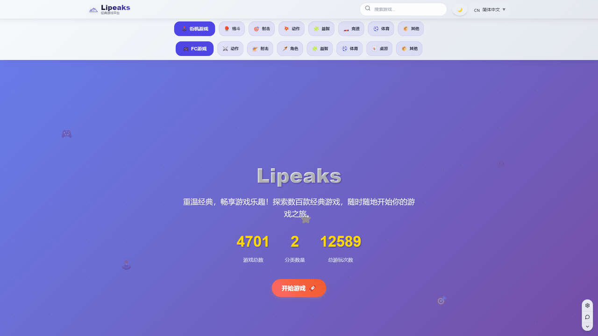

# 🎮 Lipeaks FC Games

<div align="center">


**🌟 モダンなWeb ベースレトロゲーミングプラットフォーム 🌟**

*最先端のWeb技術でクラシックなFC/NESとアーケードゲームをブラウザで再発見*

[](https://games.espressox.online)
[](https://www.gnu.org/licenses/gpl-3.0)
[](https://vuejs.org/)
[](https://vitejs.dev/)

[English](README.md) • [العربية](README-ar.md) • **日本語**

[🎯 機能](#-機能) • [🚀 クイックスタート](#-クイックスタート) • [📱 デモ](#-ライブデモ) • [🌍 言語](#-対応言語) • [🤝 貢献](#-貢献)

</div>

---

## 🌟 Lipeaks FC Gamesの特徴

🎮 **4700+のクラシックゲーム** - FC/NESとアーケードタイトルの豊富なコレクション  
🌍 **4言語対応** - 英語、中文、日本語、العربية（完全なRTLサポート付き）  
📱 **100%レスポンシブ** - デスクトップ、タブレット、モバイルで完璧な体験  
⚡ **インスタントプレイ** - ダウンロード不要、インストール不要、純粋なゲーム体験  
🎯 **モダンなUI/UX** - ゲーミング美学と現代的なデザインの融合  
📊 **スマート統計** - ゲーミング体験と成果を追跡  

## 🎬 実際に見てみる

> **🎮 [今すぐプレイ - games.espressox.online](https://games.espressox.online)**

*モダンなWeb技術の利便性でクラシックゲームのノスタルジアを体験*

### 🎮 ゲーム起動体験

*ホームページからゲームプレイまで数秒 - シームレスなゲーミング体験*

### 🌍 多言語サポート
<div align="center">

</div>

*英語、中国語、日本語、アラビア語間の切り替え（完全なRTLサポート付き）*

### 🔍 スマート検索・フィルター
<div align="center">

</div>

*強力な検索システムでお気に入りのゲームを瞬時に発見*

### 📱 完璧なモバイル体験
<div align="center">

</div>

*タッチ最適化されたコントロールとモバイルゲーミング用レスポンシブデザイン*

## ✨ 機能

### 🎮 ゲーミングエクセレンス
- **インスタントブラウザゲーミング** - EmulatorJSを使用、ダウンロード不要
- **複数プラットフォーム** - FC/NESとアーケードゲーム対応
- **高性能** - 低遅延で滑らかな60fpsゲームプレイ
- **セーブステート** - いつでもどこでも進行状況を続行
- **フルスクリーンモード** - 没入感のあるゲーム体験

### 🌍 グローバルアクセシビリティ
- **多言語インターフェース** - 4言語での完全なローカライゼーション
- **RTLレイアウト対応** - 適切なアラビア語テキストレンダリングとレイアウト
- **文化的適応** - 異なる地域に適したコンテンツ
- **アクセシビリティ準拠** - WCAG 2.1標準への準拠

### 📱 モバイルファーストデザイン
- **タッチコントロール** - モバイルデバイス用バーチャルゲームパッド
- **レスポンシブレイアウト** - すべての画面サイズに最適化
- **プログレッシブエンハンスメント** - あらゆるデバイスで動作
- **オフライン機能** - 信頼性のためのサービスワーカーキャッシング

### 📊 スマート機能
- **ゲーム統計** - 個人のプレイ追跡と分析
- **進行状況監視** - 個別ゲームの完了率
- **アチーブメントシステム** - ゲーミングマイルストーンのバッジ獲得
- **検索と発見** - お気に入りのゲームを瞬時に検索

## 🚀 クイックスタート

### 🎯 ワンクリックデプロイメント

[](https://vercel.com/new/clone?repository-url=https://github.com/fx0883/lipeaks_fc_games)
[](https://app.netlify.com/start/deploy?repository=https://github.com/fx0883/lipeaks_fc_games)

### 💻 ローカル開発

```bash
# リポジトリをクローン
git clone https://github.com/fx0883/lipeaks_fc_games.git
cd lipeaks_fc_games

# 依存関係をインストール
npm install

# 開発サーバーを開始
npm run dev
```

🌐 [http://localhost:5173](http://localhost:5173) を開いて結果を確認してください！

### 🐳 Dockerデプロイメント

```bash
# Dockerでビルドして実行
docker build -t lipeaks-fc-games .
docker run -p 80:80 lipeaks-fc-games
```

## 🛠️ 技術スタック

<div align="center">

| フロントエンド | ビルドツール | ライブラリ | エミュレーション |
|----------|-------------|-----------|-----------|
|  |  |  |  |
| Vue 3.5+ | Vite 7.0+ | Vue Router 4 | 複数コア |

</div>

- **🖖 Vue 3** - `<script setup>`を使用したComposition API
- **⚡ Vite** - 次世代ビルドツール
- **🗂️ Pinia** - 直感的な状態管理
- **🌐 Vue I18n** - 国際化フレームワーク
- **🎮 EmulatorJS** - ブラウザベースエミュレーションエンジン

## 📂 プロジェクト構造

```
lipeaks_fc_games/
├── 📁 public/              # 静的アセットとEmulatorJS
├── 📁 src/
│   ├── 📁 components/      # 再利用可能なVueコンポーネント
│   ├── 📁 composables/     # Vue合成関数
│   ├── 📁 i18n/           # 多言語サポート
│   ├── 📁 services/       # ビジネスロジックとAPI
│   ├── 📁 stores/         # Pinia状態管理
│   ├── 📁 views/          # ページレベルコンポーネント
│   └── 📁 utils/          # ユーティリティ関数
├── 📁 docs/               # プロジェクトドキュメント
└── 📄 README.md          # あなたはここにいます！
```

## 🌍 対応言語

| 言語 | ステータス | 貢献者 |
|----------|--------|--------------|
| 🇺🇸 English | ✅ 完了 | [@fx0883](https://github.com/fx0883) |
| 🇨🇳 中文 | ✅ 完了 | [@fx0883](https://github.com/fx0883) |
| 🇯🇵 日本語 | ✅ 完了 | [@fx0883](https://github.com/fx0883) |
| 🇸🇦 العربية | ✅ 完了 | [@fx0883](https://github.com/fx0883) |

**あなたの言語を追加したいですか？** [貢献ガイド](docs/CONTRIBUTING.md)をチェックしてください！

## 📚 ドキュメント

- 📖 [機能概要](docs/features.md) - 詳細な機能ドキュメント
- 🚀 [デプロイメントガイド](docs/deployment.md) - 複数のデプロイメントオプション
- 🤝 [貢献ガイド](docs/CONTRIBUTING.md) - 貢献方法
- 📸 [ビジュアルアセットガイド](docs/screenshots.md) - スクリーンショットとブランディング

## 🤝 貢献

私たちは貢献を歓迎します！バグ修正、機能追加、ドキュメント改善など、すべての貢献が重要です。

### 🌟 貢献方法

- 🐛 **バグ報告**や機能提案は[Issues](https://github.com/fx0883/lipeaks_fc_games/issues)から
- 🔧 **プルリクエスト**で改善を提出
- 🌍 **新言語の翻訳**を追加
- 📚 **ドキュメントとガイド**を改善
- 🎨 **UI/UXデザイン**を強化

### 🚀 クイック貢献

1. このリポジトリを**フォーク**
2. 機能ブランチを**作成**: `git checkout -b feature/amazing-feature`
3. 変更を**コミット**: `git commit -m 'Add amazing feature'`
4. ブランチに**プッシュ**: `git push origin feature/amazing-feature`
5. プルリクエストを**オープン**

詳細情報は[貢献ガイド](docs/CONTRIBUTING.md)をお読みください。

## 🎯 ロードマップ

- 🎮 **マルチプレイヤーサポート** - オンライン協力プレイ
- ☁️ **クラウドセーブ** - デバイス間進行状況同期
- 👥 **ユーザーアカウント** - 個人ゲーミングプロフィール
- 🎵 **強化されたオーディオ** - 向上したサウンド品質
- 🎮 **より多くのプラットフォーム** - ゲームボーイ、SNESサポート

## 📄 ライセンス

このプロジェクトは **GNU General Public License v3.0** でライセンスされています。

- ✅ **商用利用** 許可
- ✅ **変更** 許可
- ✅ **配布** 許可
- ✅ **私的利用** 許可
- ❗ **派生物には同じライセンス** が必要

詳細は[LICENSE](LICENSE)ファイルを参照してください。

## 🙏 謝辞

- 🎮 **[EmulatorJS](https://github.com/EmulatorJS/EmulatorJS)** - ブラウザエミュレーションを可能にしてくれて
- 🎨 **デザインインスピレーション** - クラシックゲーミング美学
- 🌍 **翻訳貢献者** - プラットフォームをグローバルにアクセス可能にしてくれて
- 👥 **ゲーミングコミュニティ** - テストとフィードバックのために

## ⭐ サポートを示す

このプロジェクトが有用だと思われる場合は、以下をご検討ください：

- ⭐ このリポジトリに**スター**をつける
- 🍴 **フォーク**して貢献する
- 🐛 遭遇した**問題を報告**する
- 💬 ゲーミングコミュニティと**共有**する

---

<div align="center">

**🎮 プレイする準備はできましたか？ [今すぐゲーミング開始！](https://games.espressox.online) 🎮**

*レトロゲーミングコミュニティへの❤️を込めて作成*

[](https://github.com/fx0883/lipeaks_fc_games)

</div>