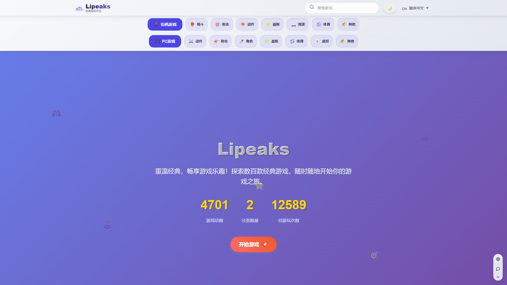
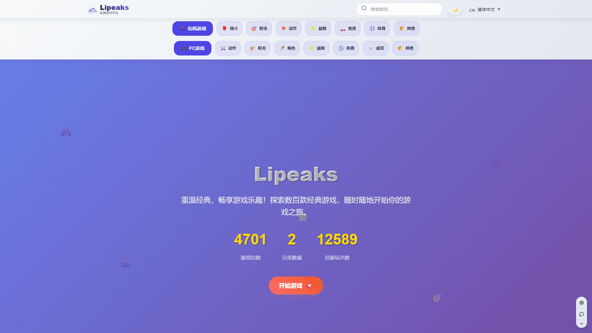
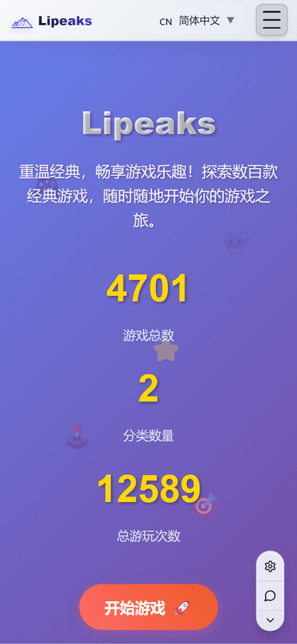
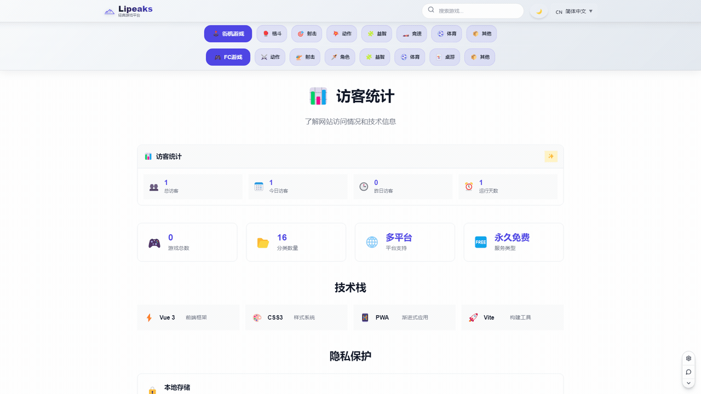
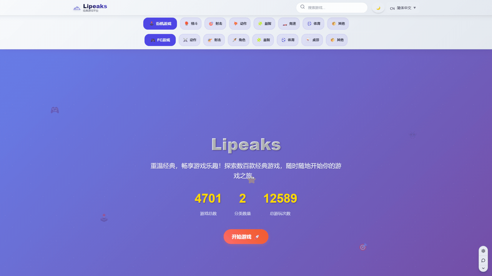

# 🎮 Lipeaks FC Games

<div align="center">


**🌟 Modern Web-Based Retro Gaming Platform 🌟**

*Rediscover classic FC/NES and Arcade games in your browser with cutting-edge web technologies*

[](https://games.espressox.online)
[](https://www.gnu.org/licenses/gpl-3.0)
[](https://vuejs.org/)
[](https://vitejs.dev/)
[](https://github.com/fx0883/lipeaks_fc_games/stargazers)

[🎯 Features](#-features) • [🚀 Quick Start](#-quick-start) • [📱 Demo](#-live-demo) • [🌍 Languages](#-languages) • [🤝 Contributing](#-contributing)

</div>

---

## 🌟 What Makes Lipeaks FC Games Special?

🎮 **4700+ Classic Games** - Extensive collection of FC/NES and Arcade titles  
🌍 **4 Languages Supported** - English, 中文, 日本語, العربية with full RTL support  
📱 **100% Responsive** - Perfect experience on desktop, tablet, and mobile  
⚡ **Instant Play** - No downloads, no installations, just pure gaming  
🎯 **Modern UI/UX** - Gaming aesthetics meet contemporary design  
📊 **Smart Statistics** - Track your gaming journey and achievements  

## 🎬 See It In Action

> **🎮 [Play Now - games.espressox.online](https://games.espressox.online)**

*Experience the nostalgia of classic gaming with the convenience of modern web technology*

### 🎮 Game Launch Experience

*From homepage to gameplay in seconds - seamless gaming experience*

### 🌍 Multi-Language Support
<div align="center">

</div>

*Switch between English, Chinese, Japanese, and Arabic with full RTL support*

### 🔍 Smart Search & Filter
<div align="center">

</div>

*Find your favorite games instantly with our powerful search system*

### 📱 Perfect Mobile Experience
<div align="center">

</div>

*Touch-optimized controls and responsive design for mobile gaming*

## ✨ Features

### 🎮 Gaming Excellence
- **Instant Browser Gaming** - EmulatorJS-powered, no downloads required
- **Multiple Platforms** - FC/NES and Arcade game support
- **High Performance** - Smooth 60fps gameplay with low latency
- **Save States** - Continue your progress anytime, anywhere
- **Full-Screen Mode** - Immersive gaming experience

### 🌍 Global Accessibility
- **Multi-Language Interface** - Complete localization in 4 languages
- **RTL Layout Support** - Proper Arabic text rendering and layout
- **Cultural Adaptations** - Appropriate content for different regions
- **Accessibility Compliance** - WCAG 2.1 standards adherence

### 📱 Mobile-First Design
- **Touch Controls** - Virtual gamepad for mobile devices
- **Responsive Layouts** - Optimized for all screen sizes
- **Progressive Enhancement** - Works on any device
- **Offline Capability** - Service worker caching for reliability

### 📊 Smart Features
- **Game Statistics** - Personal play tracking and analytics
- **Progress Monitoring** - Individual game completion rates
- **Achievement System** - Unlock badges for gaming milestones
- **Search & Discovery** - Find your favorite games instantly

## 🚀 Quick Start

### 🎯 One-Click Deployment

[](https://vercel.com/new/clone?repository-url=https://github.com/fx0883/lipeaks_fc_games)
[](https://app.netlify.com/start/deploy?repository=https://github.com/fx0883/lipeaks_fc_games)

### 💻 Local Development

```bash
# Clone the repository
git clone https://github.com/fx0883/lipeaks_fc_games.git
cd lipeaks_fc_games

# Install dependencies
npm install

# Start development server
npm run dev
```

🌐 Open [http://localhost:5173](http://localhost:5173) to see the result!

### 🐳 Docker Deployment

```bash
# Build and run with Docker
docker build -t lipeaks-fc-games .
docker run -p 80:80 lipeaks-fc-games
```

## 📊 Advanced Features

### 🎯 Game Statistics & Tracking
<div align="center">

</div>

*Track your gaming progress with detailed statistics and completion rates*

### 📱 Responsive Design Excellence
<div align="center">

</div>

*Seamless experience across all devices - desktop, tablet, and mobile*

### 🖥️ Interface Screenshots

<details>
<summary>🖼️ Click to view detailed screenshots</summary>

#### 🏠 Homepage Experience

*Clean, modern homepage with featured games and category navigation*

#### 🎮 Game Browser

*Browse through our extensive FC/NES game collection*

#### 🕹️ Game Interface

*Immersive gaming interface with full emulator controls*

#### 🔍 Search Functionality

*Powerful search with real-time filtering and results*

#### 📊 Statistics Dashboard

*Comprehensive gaming statistics and progress tracking*

#### 🌍 Multi-Language Support
<div align="center">

**English Interface**  


**中文界面**  


**日本語インターフェース**  


**واجهة عربية**  


</div>

#### 📱 Mobile Experience
<div align="center">


*Mobile-optimized interface with touch controls and responsive layout*

</div>

</details>

## 🛠️ Tech Stack

<div align="center">

| Frontend | Build Tools | Libraries | Emulation |
|----------|-------------|-----------|-----------|
|  |  |  |  |
| Vue 3.5+ | Vite 7.0+ | Vue Router 4 | Multiple Cores |

</div>

- **🖖 Vue 3** - Composition API with `<script setup>`
- **⚡ Vite** - Next-generation build tool
- **🗂️ Pinia** - Intuitive state management
- **🌐 Vue I18n** - Internationalization framework
- **🎮 EmulatorJS** - Browser-based emulation engine

## 📂 Project Structure

```
lipeaks_fc_games/
├── 📁 public/              # Static assets and EmulatorJS
├── 📁 src/
│   ├── 📁 components/      # Reusable Vue components
│   ├── 📁 composables/     # Vue composition functions
│   ├── 📁 i18n/           # Multi-language support
│   ├── 📁 services/       # Business logic and APIs
│   ├── 📁 stores/         # Pinia state management
│   ├── 📁 views/          # Page-level components
│   └── 📁 utils/          # Utility functions
├── 📁 docs/               # Project documentation
└── 📄 README.md          # You are here!
```

## 🌍 Languages

| Language | Status | Contributors |
|----------|--------|--------------|
| 🇺🇸 English | ✅ Complete | [@fx0883](https://github.com/fx0883) |
| 🇨🇳 中文 | ✅ Complete | [@fx0883](https://github.com/fx0883) |
| 🇯🇵 日本語 | ✅ Complete | [@fx0883](https://github.com/fx0883) |
| 🇸🇦 العربية | ✅ Complete | [@fx0883](https://github.com/fx0883) |

**Want to add your language?** Check our [Contributing Guide](docs/CONTRIBUTING.md)!

## 📚 Documentation

- 📖 [Features Overview](docs/features.md) - Detailed feature documentation
- 🚀 [Deployment Guide](docs/deployment.md) - Multiple deployment options
- 🤝 [Contributing Guide](docs/CONTRIBUTING.md) - How to contribute
- 📸 [Visual Assets Guide](docs/screenshots.md) - Screenshots and branding

## 🤝 Contributing

We love contributions! Whether you're fixing bugs, adding features, or improving documentation, every contribution matters.

### 🌟 Ways to Contribute

- 🐛 **Report bugs** or suggest features via [Issues](https://github.com/fx0883/lipeaks_fc_games/issues)
- 🔧 **Submit pull requests** with improvements
- 🌍 **Add translations** for new languages
- 📚 **Improve documentation** and guides
- 🎨 **Enhance UI/UX** design

### 🚀 Quick Contribution

1. **Fork** this repository
2. **Create** your feature branch: `git checkout -b feature/amazing-feature`
3. **Commit** your changes: `git commit -m 'Add amazing feature'`
4. **Push** to the branch: `git push origin feature/amazing-feature`
5. **Open** a Pull Request

Read our [Contributing Guide](docs/CONTRIBUTING.md) for detailed information.

## 📊 Project Statistics

<div align="center">


</div>

## 🎯 Roadmap

- 🎮 **Multiplayer Support** - Online co-op gaming
- ☁️ **Cloud Saves** - Cross-device progress sync
- 👥 **User Accounts** - Personal gaming profiles
- 🎵 **Enhanced Audio** - Improved sound quality
- 🎮 **More Platforms** - Game Boy, SNES support

## 📄 License

This project is licensed under the **GNU General Public License v3.0**.

- ✅ **Commercial use** allowed
- ✅ **Modification** allowed
- ✅ **Distribution** allowed
- ✅ **Private use** allowed
- ❗ **Same license** required for derivatives

See the [LICENSE](LICENSE) file for details.

## 🙏 Acknowledgments

- 🎮 **[EmulatorJS](https://github.com/EmulatorJS/EmulatorJS)** - Making browser emulation possible
- 🎨 **Design Inspiration** - Classic gaming aesthetics
- 🌍 **Translation Contributors** - Making the platform globally accessible
- 👥 **Gaming Community** - For testing and feedback

## ⭐ Show Your Support

If you find this project useful, please consider:

- ⭐ **Starring** this repository
- 🍴 **Forking** and contributing
- 🐛 **Reporting issues** you encounter
- 💬 **Sharing** with the gaming community

---

<div align="center">

**🎮 Ready to play? [Start Gaming Now!](https://games.espressox.online) 🎮**

*Made with ❤️ for the retro gaming community*

[](https://github.com/fx0883/lipeaks_fc_games)

</div>