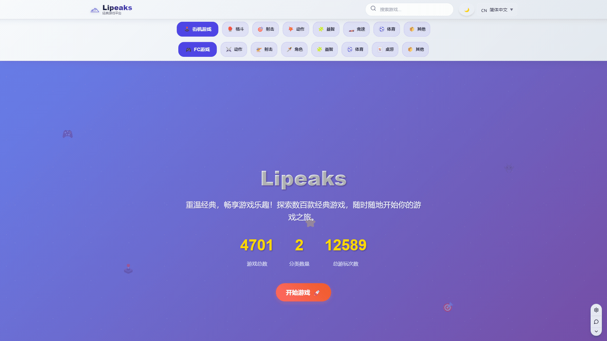
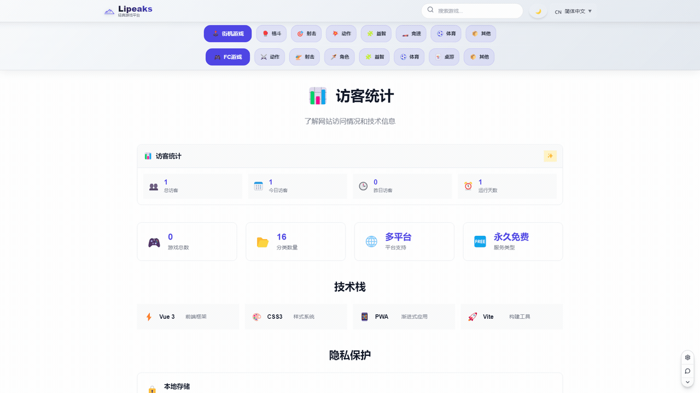
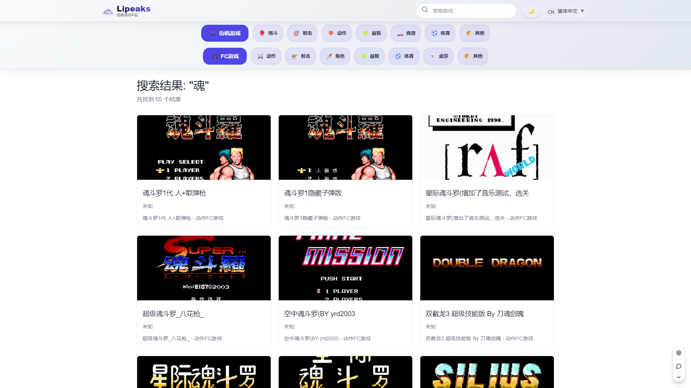
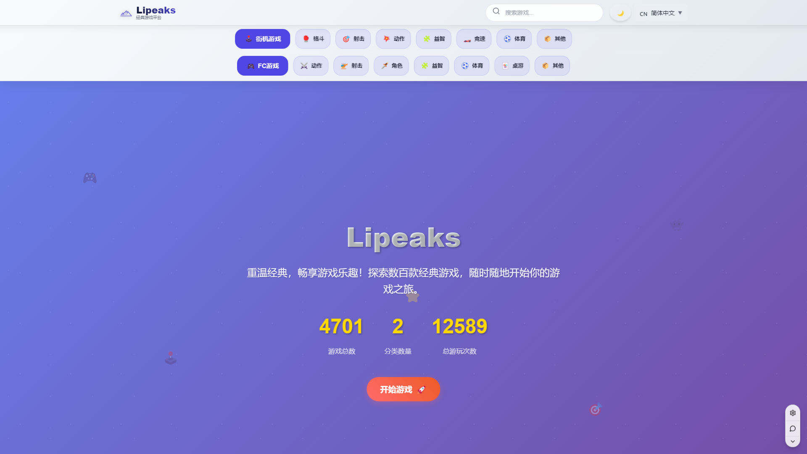
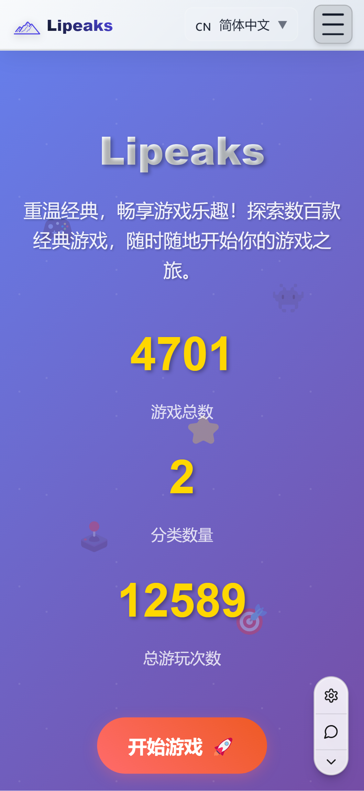

# 🌟 Features Overview

Lipeaks FC Games offers a comprehensive gaming experience with modern web technologies and user-focused design. Here's what makes our platform special.

## 🎬 Visual Feature Demonstrations

### 🎮 Complete Gaming Experience

*Seamless transition from homepage to full gameplay - the complete user journey*

### 🌍 Multi-Language Excellence

*Dynamic language switching with full RTL support for Arabic users*

### 🔍 Intelligent Search System

*Powerful search functionality with real-time filtering and instant results*

### 📱 Mobile-First Design

*Touch-optimized interface with virtual controls designed for mobile gaming*

### 📊 Advanced Statistics

*Comprehensive tracking of gaming progress and detailed analytics*

### 📐 Responsive Design

*Seamless adaptation across desktop, tablet, and mobile devices*

## 🎮 Core Gaming Features

### 🕹️ Instant Browser Gaming
- **No downloads required** - Play games directly in your browser
- **Fast loading times** - Optimized ROM delivery and caching
- **Multiple emulator cores** - Support for various game types
- **Save states** - Continue your progress anytime
- **Full-screen mode** - Immersive gaming experience

### 🎯 Game Library Management
- **4700+ classic games** across 2 main platforms (FC/NES, Arcade)
- **Smart categorization** - Action, RPG, Sports, Puzzle, and more
- **Advanced search** - Find games by name, category, or keyword
- **Game statistics** - Track play counts and popular titles
- **Favorites system** - Save your preferred games

### 📊 Game Statistics & Progress
- **Individual game tracking** - Personal play counts and time
- **Completion rates** - Progress tracking for each game
- **Global statistics** - Platform-wide gaming metrics
- **Achievement system** - Unlock badges for milestones
- **Play history** - View your gaming journey

## 🌍 Internationalization Features

### 🌐 Multi-Language Support
- **4 languages** supported: English, 中文, 日本語, العربية
- **Complete interface translation** - Every UI element localized
- **RTL layout support** - Proper Arabic text rendering
- **Cultural adaptations** - Appropriate icons and content
- **Dynamic language switching** - Change language without reload

### 🎨 Localized Content
- **Game name translations** - Native language game titles
- **Category descriptions** - Localized game categorization
- **Help documentation** - Multi-language user guides
- **Error messages** - Translated feedback and alerts

## 📱 Responsive Design Excellence

### 🖥️ Multi-Device Support
- **Desktop optimization** - Full-featured experience
- **Tablet compatibility** - Touch-friendly interface
- **Mobile-first design** - Optimized for smartphones
- **Progressive enhancement** - Works on any device

### 🎮 Touch Controls
- **Virtual gamepad** - On-screen controls for mobile
- **Haptic feedback** - Tactile response (where supported)
- **Gesture support** - Swipe and pinch interactions
- **Orientation handling** - Landscape/portrait modes

### 📐 Adaptive Layouts
- **Flexible grid system** - Automatic content arrangement
- **Responsive typography** - Readable text at any size
- **Smart image scaling** - Optimized for different screens
- **Performance optimization** - Smooth experience on all devices

## 🖼️ Interface Screenshots

### 🏠 Homepage Experience

*Modern, clean homepage design with featured games and intuitive navigation*

### 🎮 Game Category Browser

*Organized game categories with visual previews and filtering options*

### 🕹️ Game Playing Interface

*Full-featured game interface with emulator controls and statistics*

### 🔍 Search Functionality

*Advanced search with real-time filtering and comprehensive results*

### 📊 Statistics Dashboard

*Detailed gaming analytics and progress tracking*

### 🌍 Multi-Language Interfaces

#### English Interface

#### 中文界面

#### 日本語インターフェース

#### واجهة عربية

### 📱 Mobile Responsive Design

*Mobile-optimized interface with touch controls and responsive layout*

## 🎨 Modern UI/UX Design

### 🌈 Visual Design System
- **Gaming-inspired aesthetics** - Retro meets modern
- **Consistent color palette** - Unified visual identity
- **Dark/light theme support** - Automatic theme detection
- **Smooth animations** - Polished micro-interactions
- **Accessibility compliance** - WCAG 2.1 standards

### ⚡ Performance Features
- **Lazy loading** - Load content as needed
- **Image optimization** - WebP format with fallbacks
- **Code splitting** - Efficient bundle loading
- **Service worker caching** - Offline-capable experience
- **CDN integration** - Global content delivery

### 🎭 Interactive Elements
- **Hover effects** - Rich interaction feedback
- **Loading states** - Clear progress indicators
- **Error handling** - User-friendly error messages
- **Keyboard navigation** - Full accessibility support

## ⚙️ Technical Excellence

### 🚀 Modern Tech Stack
- **Vue 3** with Composition API - Latest framework features
- **Vite** build system - Lightning-fast development
- **Pinia** state management - Reactive data flow
- **Vue Router** - Client-side routing
- **Vue I18n** - Internationalization framework

### 🔧 Developer Experience
- **TypeScript support** - Type-safe development
- **ESLint configuration** - Code quality enforcement
- **Hot module replacement** - Instant development feedback
- **Component documentation** - Well-documented codebase
- **Git hooks** - Automated quality checks

### 📦 Build & Deployment
- **Tree shaking** - Optimized bundle sizes
- **Code splitting** - Efficient loading strategies
- **Static site generation** - SEO-friendly builds
- **Docker support** - Containerized deployment
- **CI/CD integration** - Automated testing and deployment

## 🎯 User Experience Features

### 🔍 Discovery & Navigation
- **Intelligent search** - Find games quickly
- **Category browsing** - Organized game exploration
- **Recently played** - Quick access to recent games
- **Recommended games** - Personalized suggestions
- **Breadcrumb navigation** - Always know where you are

### 💾 Data Persistence
- **Local storage** - Settings and preferences saved
- **Game progress** - Automatic save state management
- **Cross-session continuity** - Resume where you left off
- **Import/export saves** - Backup your progress
- **Cloud sync ready** - Future cloud save support

### 🎵 Audio & Video
- **High-quality audio** - Authentic game sounds
- **Video recording ready** - Capture gameplay moments
- **Audio controls** - Master volume and mute options
- **Multiple audio tracks** - Different sound channels
- **Audio optimization** - Reduced latency and artifacts

## 🔒 Security & Privacy

### 🛡️ Security Features
- **Content Security Policy** - XSS protection
- **HTTPS enforcement** - Secure data transmission
- **Input sanitization** - Safe user input handling
- **CORS configuration** - Controlled resource access
- **Regular updates** - Latest security patches

### 🕵️ Privacy Protection
- **No tracking by default** - Minimal data collection
- **Local-first approach** - Data stays on your device
- **Optional analytics** - User-controlled metrics
- **GDPR compliance** - European privacy standards
- **Transparent policies** - Clear privacy documentation

## 📈 Analytics & Monitoring

### 📊 Usage Statistics
- **Play count tracking** - Game popularity metrics
- **Performance monitoring** - System health checks
- **Error tracking** - Proactive issue detection
- **User engagement** - Feature usage analytics
- **Load time monitoring** - Performance optimization data

### 🔧 Administrative Features
- **Health dashboards** - System status overview
- **Performance metrics** - Real-time monitoring
- **Error logging** - Detailed error reports
- **Usage reports** - Comprehensive analytics
- **Update notifications** - New feature announcements

## 🌟 Unique Selling Points

### 🎮 Gaming Excellence
- **Authentic emulation** - True-to-original gaming experience
- **Multiple emulator cores** - Best compatibility for each game
- **High performance** - Smooth 60fps gameplay
- **Low latency** - Responsive controls
- **Quality assurance** - Tested game compatibility

### 🌐 Global Accessibility
- **Worldwide audience** - Multi-language support
- **Cultural sensitivity** - Appropriate localization
- **Inclusive design** - Accessible to all users
- **Cross-platform** - Works everywhere
- **Progressive enhancement** - Graceful degradation

### 🛠️ Developer Friendly
- **Open source** - GPL-3.0 licensed
- **Well documented** - Comprehensive guides
- **Modular architecture** - Easy to extend
- **Modern tooling** - Latest development practices
- **Community driven** - Collaborative development

## 🚀 Future Roadmap

### 🎯 Planned Features
- **Multiplayer support** - Online co-op gaming
- **Cloud saves** - Cross-device progress sync
- **User accounts** - Personal gaming profiles
- **Social features** - Share achievements and progress
- **Custom controllers** - Extended gamepad support

### 🔮 Vision
- **Largest retro gaming platform** - Comprehensive game library
- **Community hub** - Gaming enthusiast gathering place
- **Educational resource** - Gaming history preservation
- **Technology showcase** - Modern web capabilities
- **Cultural bridge** - Connect gamers worldwide

---

These features combine to create a **unique, modern, and accessible** gaming platform that brings classic games to today's web-native world! 🎮✨