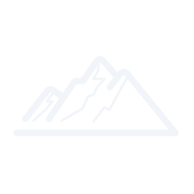
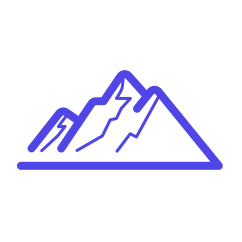
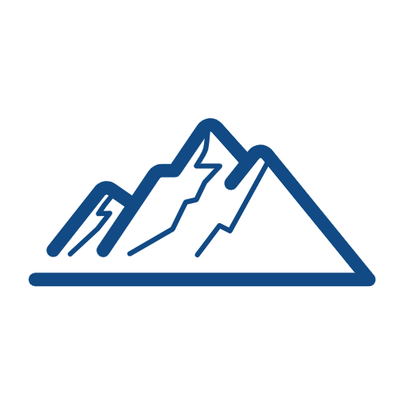
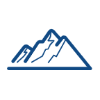
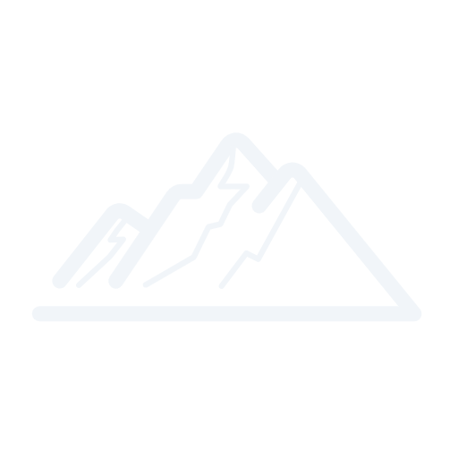
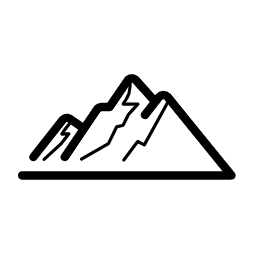
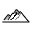

# 🎨 Logo文件索引

> 生成时间: 2025-08-08T05:05:02.026Z

## 📂 SVG格式Logo

-  - lipeaks-logo-dark-theme.svg
-  - lipeaks-logo-light-theme.svg
-  - lipeaks-logo-monochrome.svg
-  - lipeaks-logo-original.svg

## 📂 PNG格式Logo

### 标准尺寸

-  - lipeaks-logo-original-128x128.png
-  - lipeaks-logo-original-16x16.png
-  - lipeaks-logo-original-256x256.png
-  - lipeaks-logo-original-32x32.png
-  - lipeaks-logo-original-512x512.png
-  - lipeaks-logo-original-64x64.png

### 主题变体

-  - favicon-144x144.png
-  - favicon-16x16.png
-  - favicon-192x192.png
-  - favicon-32x32.png
-  - favicon-48x48.png
-  - favicon-96x96.png
-  - favicon.png
-  - lipeaks-logo-dark-theme-128x128.png
-  - lipeaks-logo-dark-theme-16x16.png
-  - lipeaks-logo-dark-theme-256x256.png
-  - lipeaks-logo-dark-theme-32x32.png
-  - lipeaks-logo-dark-theme-512x512.png
-  - lipeaks-logo-dark-theme-64x64.png
-  - lipeaks-logo-light-theme-128x128.png
-  - lipeaks-logo-light-theme-16x16.png
-  - lipeaks-logo-light-theme-256x256.png
-  - lipeaks-logo-light-theme-32x32.png
-  - lipeaks-logo-light-theme-512x512.png
-  - lipeaks-logo-light-theme-64x64.png
-  - lipeaks-logo-monochrome-128x128.png
-  - lipeaks-logo-monochrome-16x16.png
-  - lipeaks-logo-monochrome-256x256.png
-  - lipeaks-logo-monochrome-32x32.png
-  - lipeaks-logo-monochrome-512x512.png
-  - lipeaks-logo-monochrome-64x64.png

## 📖 使用说明

### SVG Logo
- **原始版本**: `lipeaks-logo-original.svg` - 项目原始设计
- **亮色主题**: `lipeaks-logo-light-theme.svg` - 适用于浅色背景
- **暗色主题**: `lipeaks-logo-dark-theme.svg` - 适用于深色背景
- **单色版本**: `lipeaks-logo-monochrome.svg` - 适用于单色显示

### PNG Logo
- **多种尺寸**: 512px, 256px, 128px, 64px, 32px, 16px
- **透明背景**: 适合各种背景色
- **高质量**: 适合打印和高分辨率显示

### 网站图标
- **Favicon**: 16x16, 32x32, 48x48等多种尺寸
- **PWA图标**: 96x96, 144x144, 192x192

### 文件命名规范
```
格式: [项目名]-logo-[主题]-[尺寸].[扩展名]

示例:
- lipeaks-logo-original.svg
- lipeaks-logo-light-theme-256x256.png
- favicon-32x32.png
```

